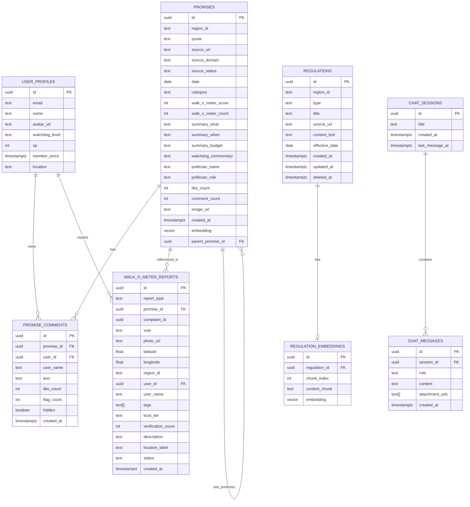

# Entity Relationship Diagram (ERD)

This document provides a visual representation and detailed description of the database schema for the WIWOKDETOK project.

## Diagram

## Tables and Descriptions

### `PROMISES` (F-001)
Tracks political promises, environmental pledges, and their progress.
- `id`: Unique identifier.
- `region_id`: Associated Indonesian region code.
- `quote`: The direct political statement.
- `source_url`: Link to the source (news, social media).
- `category`: `new_promise`, `progress_update`, or `fulfillment`.
- `walk_o_meter_score`: Community trust score.
- `parent_promise_id`: FK to another promise (for tracking updates to a specific pledge).

### `PROMISE_COMMENTS`
User interaction on specific promises.
- `promise_id`: FK to `PROMISES`.
- `user_id`: FK to `USER_PROFILES`.

### `REGULATIONS` (RAG for Bang Jaga)
Local and national regulations stored for AI context.
- `type`: `perda` (local), `uu` (law), or `pp` (government regulation).
- `content_text`: Full text of the regulation.

### `REGULATION_EMBEDDINGS`
Vector chunks of regulations for semantic search.
- `embedding`: Vector data (768 dimensions).

### `WALK_O_METER_REPORTS` (F-003)
Ground-truth field reports from users.
- `promise_id`: Linked promise being verified.
- `photo_url`: Evidence from the field.
- `latitude` / `longitude`: Geolocation of the report.
- `status`: `pending`, `accepted`, `rejected`, or `resolved`.

### `USER_PROFILES`
User data and gamification status.
- `watchdog_level`: Level based on XP.

### `CHAT_SESSIONS` & `CHAT_MESSAGES`
Bang Jaga AI assistant conversation history.
- `session_id`: Links messages to a specific session.
